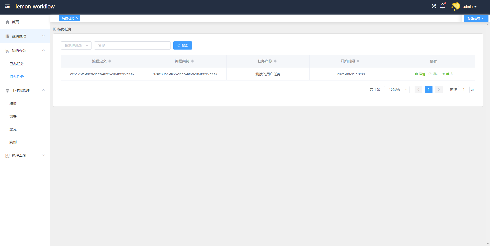
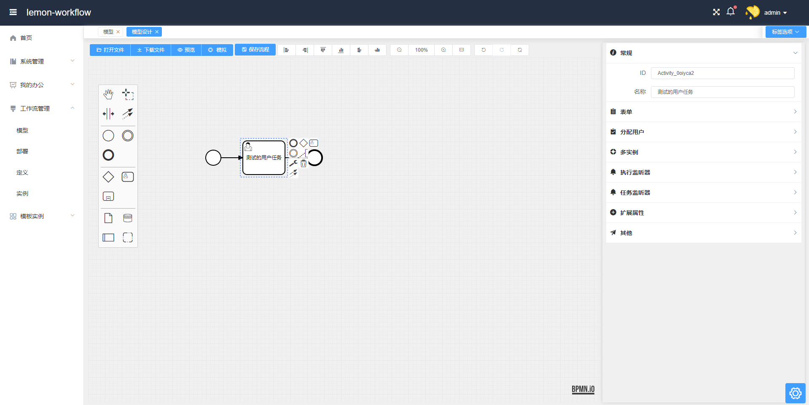
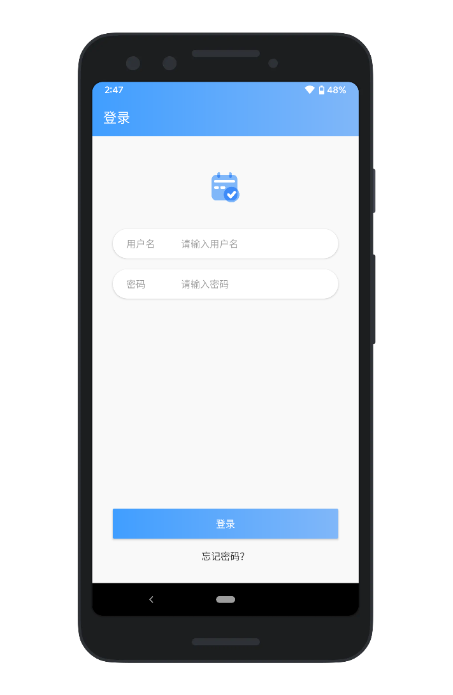
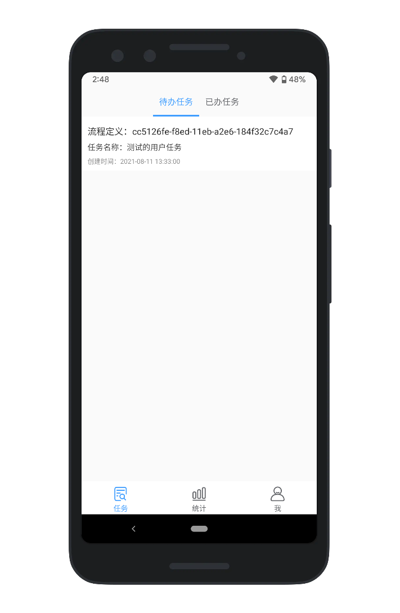

# <center>lemon-workflow: A BPM platform</center>

## 项目简介

lemon-workflow是一个基于Flowable(V6)引擎的BPM平台，采用前后端分离架构。目前已经集成了流程设计、工作流管理等功能。

技术栈如下：

后端：SpringBoot 2.x + Flowable 6.x + mybatis

前端：Vue 2.x  + bpmn-js + element-ui + vue-router + axios + @vue/cli

欢迎issues、PR~~ 如果此项目对你有所帮助，麻烦动动小手给个Star⭐

## 项目截图






## 项目特性

- 基于Flowable6开发的业务流程管理平台，有着更加完善的功能
- 集成了基于bpmn-js的流程设计器和基于vuedraggable的表单设计器，对Web设计更友好
- 支持Android移动端，共享数据接口
- 支持Docker部署
- 更多功能正在开发中……

## 如何使用

**后端：lemon-workflow-backend**

- 建立lemon_workflow数据库，指定字符集为utf-8
- 运行src/test/java/com/lemon/engine/EngineApplicationTests.java下的addAllUser()方法，添加测试用户
- 运行EngineApplication主程序
- 测试接口：http://localhost:8081/process-api/repository/process-definitions. （[点击](https://flowable.com/open-source/docs/bpmn/ch15-REST/)参考更多Flowable提供的REST API）

**前端：lemon-workflow-frontend**

```
# 安装依赖
npm install
# 运行
npm run serve
```

**Android端：lemonworkflowandroid**

- 修改com.lemon.mobile.util下的UrlFactory为你的服务器地址。

- Android Studio运行


## TODO

- 引入表单
- 完善的权限管理
- 加入SpringSecurity+OAuth2实现认证授权和安全保护

## 感谢以下开源库

[bpmn-process-designer](https://github.com/miyuesc/bpmn-process-designer)

[vue-manage-system](https://github.com/lin-xin/vue-manage-system/tree/V4.2.0)

[vue-form-making](https://github.com/GavinZhuLei/vue-form-making)

